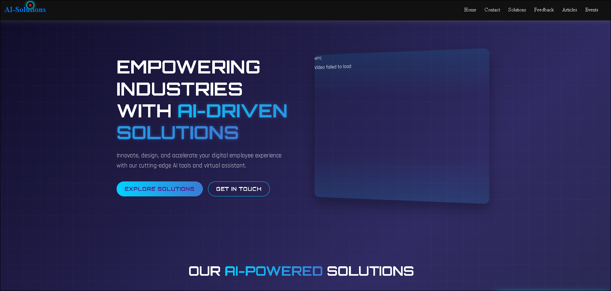
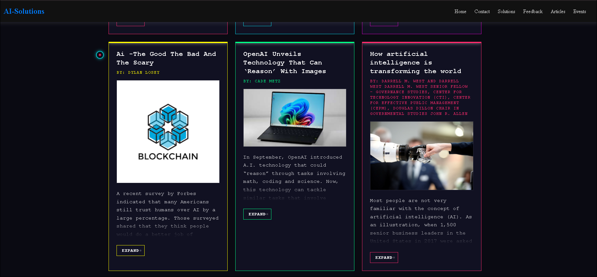

## Overview

This repository contains the source code for a corporate marketing website. The frontend is a dynamic Single-Page Application (SPA) built with Angular, designed for a seamless user experience. It is supported by a robust Spring Boot backend API that handles business logic and communication, such as processing contact form submissions.

The primary goal of this application is to effectively communicate the company's value proposition ("Empowering Industries with AI-Driven Solutions") and convert visitors into potential clients.

## Features

Modern Landing Page: Featuring a hero section with a clear call-to-action.

Solutions Showcase: A dedicated section to highlight key AI products and services.

Interactive Contact Form: A functional form for lead generation with real-time validation and feedback.

Fully Responsive: Optimized for desktop, tablet, and mobile devices.

Dynamic Content: Easy integration of videos and other media.

## Architecture

The project is structured as a monorepo with two main components:

text
├── /frontend          # Angular application
└── /backend           # Spring Boot application
Frontend (Angular)
The frontend directory houses the client-side application.

Framework: Angular

Language: TypeScript

Styling: Angular Material & custom SCSS

HTTP Client: Angular's HttpClient for API communication

Backend (Spring Boot)
The backend directory contains the server-side API.

# Framework: Spring Boot

# Language: Java

# Main Responsibilities:

REST API endpoints

Email service integration (e.g., SendGrid)

CORS configuration

Data validation and security

## Getting Started

Follow these instructions to get a copy of the project up and running on your local machine for development and testing purposes.

Prerequisites

Node.js (v18 or higher) & npm

Angular CLI (npm install -g @angular/cli)

Java JDK (11 or higher)

Maven (or Gradle)

Installation & Development
Clone the repository

bash
git clone https://github.com/your-username/your-repo-name.git
cd your-repo-name
Set up the Backend (Spring Boot)

bash
cd backend
mvn clean install
mvn spring-boot:run
The API server will start on http://localhost:8080.

Set up the Frontend (Angular)

bash
cd ../frontend
npm install
ng serve
The client application will be available on http://localhost:4200.

Configure Environment Variables
Create a application.properties file in backend/src/main/resources/ with your email service credentials:

#properties

# Example for SendGrid
sendgrid.api.key=your_sendgrid_api_key_here
email.recipient=sales@yourcompany.com
📡 API Reference
Submit Contact Form
Sends a message from the website's contact form.

Endpoint: POST /api/contact

Request Body:

json
{
  "name": "John Doe",
  "email": "john.doe@example.com",
  "message": "I'm interested in your AI solutions."
}
Success Response: 200 OK

🧪 Running Tests
To execute the test suites, run the following commands:

Backend Tests:

bash
cd backend
mvn test
Frontend Tests:

bash
cd frontend
ng test
🌐 Deployment
This application is designed for easy deployment on modern cloud platforms.

# Frontend: The built Angular static files are deployed to Netlify or Firebase Hosting.

# Backend: The Spring Boot JAR file is deployed to Heroku or AWS Elastic Beanstalk.

## Pictures 

## License
This project is the proprietary property of [Lethabo Matlala]. All rights reserved.

